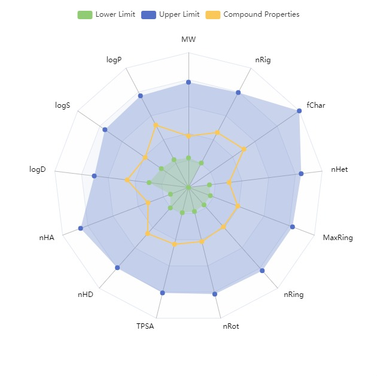
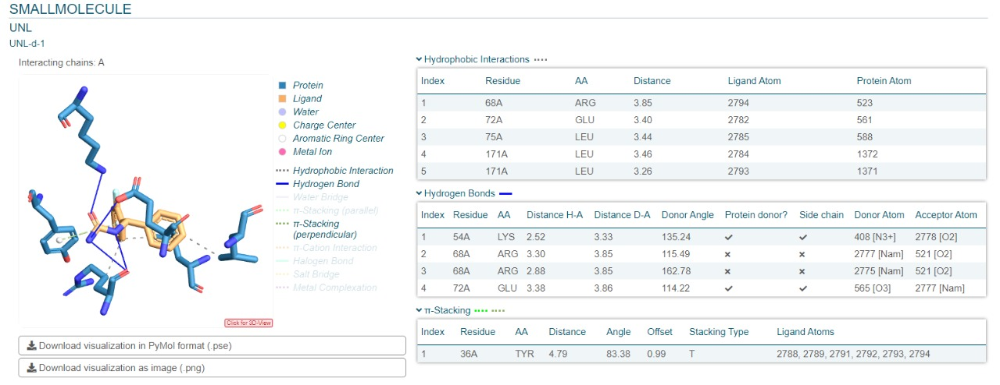
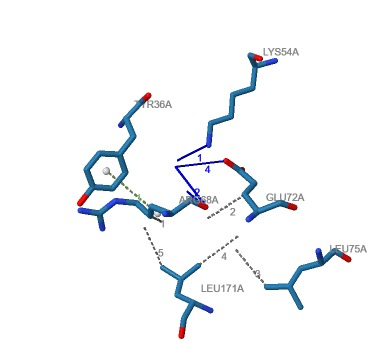
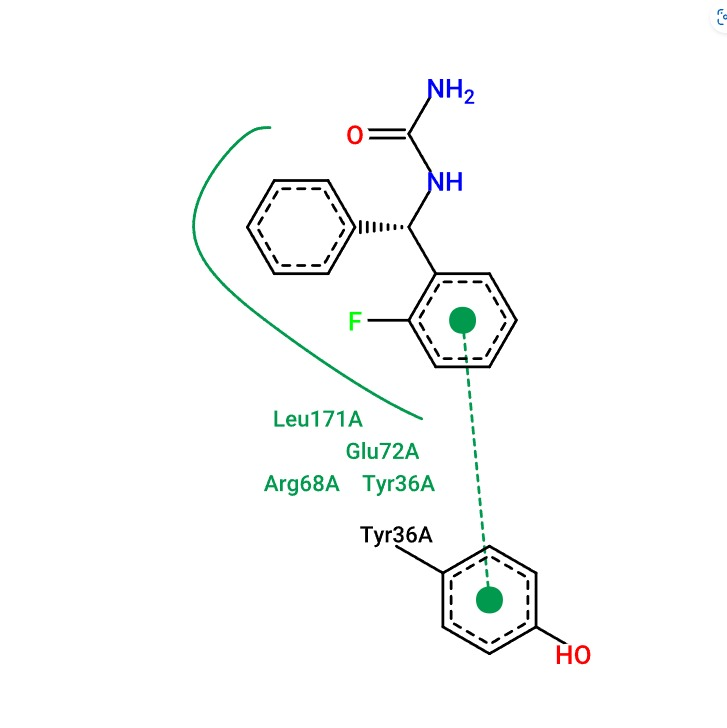
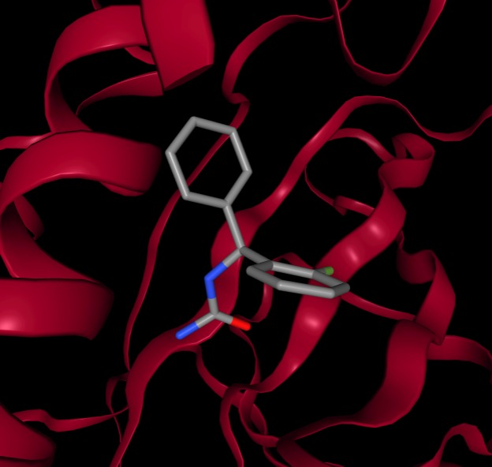
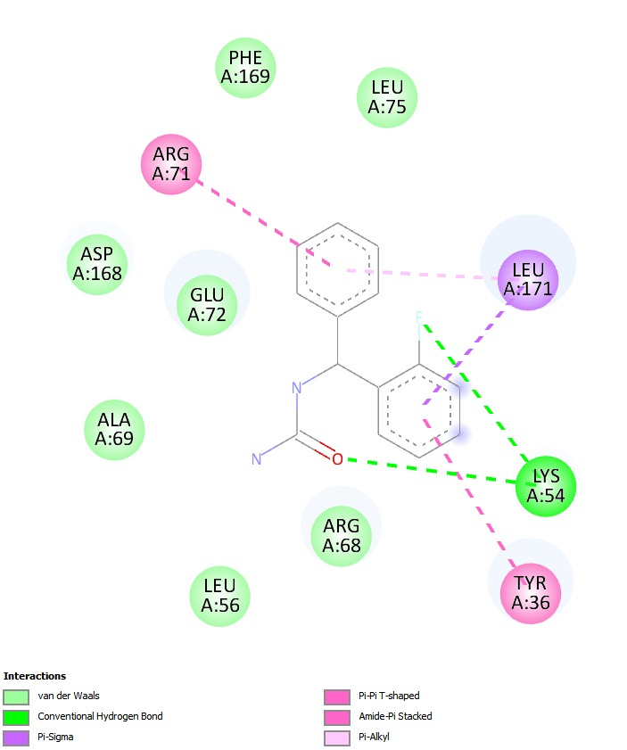
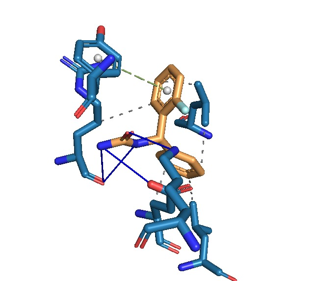

# Коментарий

В данном отчете нет диаграм/графиков/рисунков, так как для каждого вещества их проще сгенерировать по необходимости. Примеры илюстраций привожу далее:

### ADMET



Радар биоактивности. Позволяет визуализировать соответствие правилам биоактивности.

### DOCKING
Визуализации карманов связывания







## Выводы


## Введение

В этом отчете представлены результаты виртуального скрининга 39 моллекул, которые были проведены с использованием Autodock Vina. Целью скрининга было найти соединения, которые могут быть перспективными кандидатами для разработки новых антиепилептических препаратов.

## Методы

### Подготовка моллекул

Моллекулы были подготовлены с использованием программы Open Babel.

### Подготовка белков

Белки были получены из базы данных Protein Data Bank (PDB).

### Виртуальный скрининг

Виртуальный скрининг был проведен с использованием программы Autodock Vina.

## Результаты


# Виртульный скрининг

>Autodock Vina

39 моллекул в 3 рецептора

### SMI библиотека

```smi
NC(NC(C1=C(Cl)C=CC=C1)C2=CC=CC=C2)=O galodif
O=C(NC(C1CC=CC=C1)C2=CC=CC=C2)NC(C3=CC=CC=C3)C4=C([F])C=CC=C4 dibgm-o-F
O=C(NC(C1CC=CC=C1)C2=CC=CC=C2)NC(C3=CC=CC=C3)C4=CC([F])=CC=C4 dibgm-m-F
O=C(NC(C1CC=CC=C1)C2=CC=CC=C2)NC(C3=CC=CC=C3)C4=CC=C([F])C=C4 dibgm-p-F
NC(NC(C1=CC=CC=C1)C2=C([F])C=CC=C2)=O bgm-o-F
NC(NC(C1=CC=CC=C1)C2=CC([F])=CC=C2)=O bgm-m-F
NC(NC(C1=CC=CC=C1)C2=CC=C([F])C=C2)=O bgm-p-F
O=C(NC(C(F)(F)F)=O)NC(C1=CC=CC=C1)C2=C([F])C=CC=C2 3Fbgm-o-F
O=C(NC(C(F)(F)F)=O)NC(C1=CC=CC=C1)C2=CC([F])=CC=C2 3Fbgm-m-F
O=C(NC(C(F)(F)F)=O)NC(C1=CC=CC=C1)C2=CC=C([F])C=C2 3Fbgm-p-F
O=C(NC(C1CC=CC=C1)C2=CC=CC=C2)NC(C3=CC=CC=C3)C4=C([Cl])C=CC=C4 dibgm-o-Cl
O=C(NC(C1CC=CC=C1)C2=CC=CC=C2)NC(C3=CC=CC=C3)C4=CC([Cl])=CC=C4 dibgm-m-Cl
O=C(NC(C1CC=CC=C1)C2=CC=CC=C2)NC(C3=CC=CC=C3)C4=CC=C([Cl])C=C4 dibgm-p-Cl
NC(NC(C1=CC=CC=C1)C2=C([Cl])C=CC=C2)=O bgm-o-Cl
NC(NC(C1=CC=CC=C1)C2=CC=C([Cl])C=C2)=O bgm-p-Cl
O=C(NC(C(F)(F)F)=O)NC(C1=CC=CC=C1)C2=C([Cl])C=CC=C2 3Fbgm-o-Cl
O=C(NC(C(F)(F)F)=O)NC(C1=CC=CC=C1)C2=CC([Cl])=CC=C2 3Fbgm-m-Cl
O=C(NC(C(F)(F)F)=O)NC(C1=CC=CC=C1)C2=CC=C([Cl])C=C2 3Fbgm-p-Cl
O=C(NC(C1CC=CC=C1)C2=CC=CC=C2)NC(C3=CC=CC=C3)C4=C([Br])C=CC=C4 dibgm-o-Br
O=C(NC(C1CC=CC=C1)C2=CC=CC=C2)NC(C3=CC=CC=C3)C4=CC([Br])=CC=C4 dibgm-m-Br
O=C(NC(C1CC=CC=C1)C2=CC=CC=C2)NC(C3=CC=CC=C3)C4=CC=C([Br])C=C4 dibgm-p-Br
NC(NC(C1=CC=CC=C1)C2=C([Br])C=CC=C2)=O bgm-o-Br
NC(NC(C1=CC=CC=C1)C2=CC([Br])=CC=C2)=O bgm-m-Br
NC(NC(C1=CC=CC=C1)C2=CC=C([Br])C=C2)=O bgm-p-Br
O=C(NC(C(F)(F)F)=O)NC(C1=CC=CC=C1)C2=C([Br])C=CC=C2 3Fbgm-o-Br
O=C(NC(C(F)(F)F)=O)NC(C1=CC=CC=C1)C2=CC([Br])=CC=C2 3Fbgm-m-Br
O=C(NC(C(F)(F)F)=O)NC(C1=CC=CC=C1)C2=CC=C([Br])C=C2 3Fbgm-p-Br
O=C(NC(C1CC=CC=C1)C2=CC=CC=C2)NC(C3=CC=CC=C3)C4=C([I])C=CC=C4 dibgm-o-I
O=C(NC(C1CC=CC=C1)C2=CC=CC=C2)NC(C3=CC=CC=C3)C4=CC([I])=CC=C4 dibgm-m-I
O=C(NC(C1CC=CC=C1)C2=CC=CC=C2)NC(C3=CC=CC=C3)C4=CC=C([I])C=C4 dibgm-p-I
NC(NC(C1=CC=CC=C1)C2=C([I])C=CC=C2)=O bgm-o-I
NC(NC(C1=CC=CC=C1)C2=CC([I])=CC=C2)=O bgm-m-I
NC(NC(C1=CC=CC=C1)C2=CC=C([I])C=C2)=O bgm-p-I
O=C(NC(C(F)(F)F)=O)NC(C1=CC=CC=C1)C2=C([I])C=CC=C2 3Fbgm-o-I
O=C(NC(C(F)(F)F)=O)NC(C1=CC=CC=C1)C2=CC([I])=CC=C2 3Fbgm-m-I
O=C(NC(C(F)(F)F)=O)NC(C1=CC=CC=C1)C2=CC=C([I])C=C2 3Fbgm-p-I
```


Белки VGSCs (волновые зависимые натриевые каналы), NMDA (N-метил-D-аспартатные рецепторы) и GABAA (гамма-аминомасляная кислота A-рецепторы) были выбраны для проверки в исследовании по следующим причинам:

VGSCs (волновые зависимые натриевые каналы): Эти каналы играют ключевую роль в генерации и проведении электрических сигналов в нейронах. Они отвечают за деполяризацию клеточной мембраны и инициирование действия потенциалов. Активация VGSCs может способствовать возникновению судорог, что делает их важной мишенью для антиепилептических препаратов. Ингибирование этих каналов может помочь в контроле судорог и улучшении состояния пациентов с эпилепсией.

NMDA (N-метил-D-аспартатные рецепторы): NMDA-рецепторы являются типом глутаматных рецепторов, которые участвуют в синаптической пластичности и нейротрансмиссии. Они играют важную роль в процессах, связанных с обучением и памятью, а также в патогенезе эпилепсии. Избыточная активация NMDA-рецепторов может приводить к нейротоксичности и судорогам, что делает их важной мишенью для разработки новых антиепилептических средств.

GABAA (гамма-аминомасляная кислота A-рецепторы): GABAA-рецепторы являются основными ингибирующими рецепторами в центральной нервной системе. Они играют критическую роль в регуляции нейронной активности и предотвращении чрезмерной возбудимости, что особенно важно для контроля судорог. Активация GABAA-рецепторов приводит к увеличению потока хлора в нейрон, что вызывает гиперполяризацию и уменьшает вероятность генерации действия потенциала. Это делает GABAA-рецепторы важной мишенью для антиепилептических препаратов, так как их активация может помочь в снижении судорожной активности.

Таким образом, выбор этих белков для проверки позволяет исследовать механизмы действия новых соединений и их потенциальную эффективность в лечении эпилепсии, а также оценить их взаимодействие с ключевыми мишенями, связанными с заболеванием.


План работы/анализа результатов

1. ADMET
2. DOCKING
3. Сравнение с экспериментальными данными

>Анализ будет выполняться по группам bgm|dibgm|3Fbgm

Ссылки на соотвествующие файлы отчета по группам:
* **bgm** - [bgm.md](bgm.md)
* **dibgm** - [dibgm.md](dibgm.md) (В процессе)
* **3Fbgm** - [3Fbgm.md](3Fbgm.md) (В процессе)
